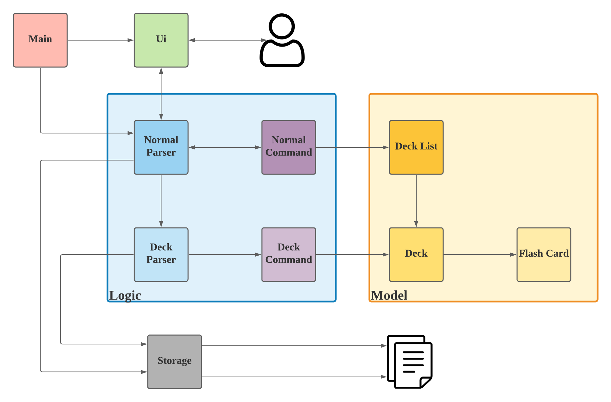
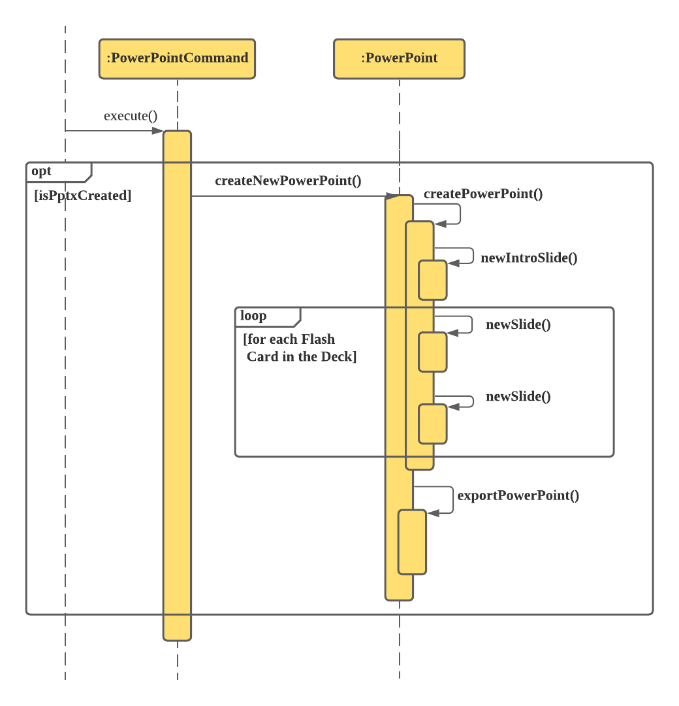
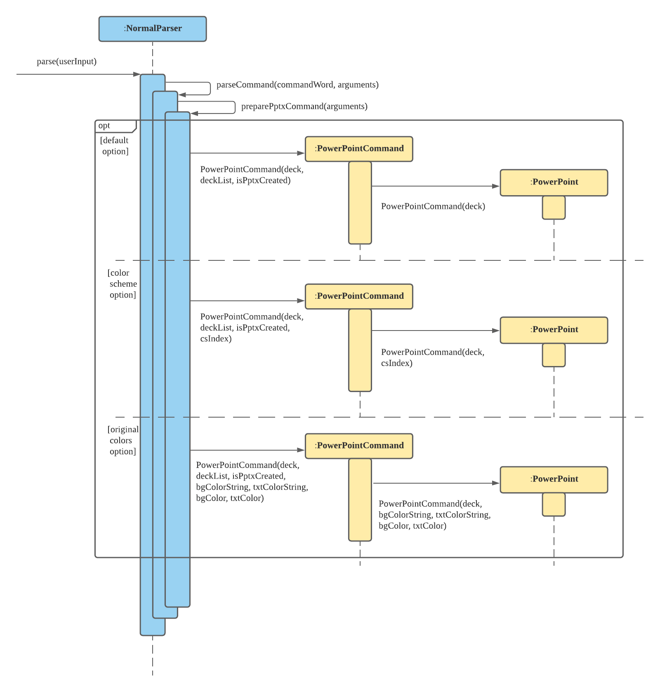

# Developer Guide

## Introduction

Flash Card manager for Economics students on Command Line.

See also: [User Guide](./UserGuide.md) | [Releases](https://github.com/AY2021S1-CS2113-T14-2/tp/releases) | [Team Project Portfolio Page](./AboutUs.md)

## Contents

- [Design](#design)
  * [Application Architecture](#application-architecture)
    + [How the components interact with one another](#how-the-components-interact-with-one-another)
  * [User Interface](#user-interface)
  * [Logic](#logic)
    + [Overall Logic](#overall-logic)
    + [Commands](#commands)
      - [Overview](#overview)
      - [Mode-specific commands](#mode-specific-commands)
      - [Command sequence](#command-sequence)
  * [Deck Model](#deck-model)
  * [Storage](#storage)
    + [Loading the deckList data](#loading-the-decklist-data)
    + [Writing the deckList data](#writing-the-decklist-data)
  * [Exceptions](#exceptions)
- [Implementation - Features](#implementation---features)
  * [Print to PowerPoint SlideShow](#print-to-powerpoint-slideshow)
    + [Color Selection](#color-selection)
    + [Default](#default)
    + [Color Scheme](#color-scheme)
    + [Original Color](#original-color)
  * [Pretty Printing](#pretty-printing)
  * [Tags for grouping and searching decks](#tags-for-grouping-and-searching-decks)
  * [Game Mode](#game-mode)
    + [General Architecture](#general-architecture)
    + [Example Use Case](#example-use-case)
    + [Sequential Flow](#sequential-flow)
- [Product scope](#product-scope)
  * [Target user profile](#target-user-profile)
  * [Value proposition](#value-proposition)
- [User Stories](#user-stories)
- [Non-Functional Requirements](#non-functional-requirements)
- [Glossary](#glossary)
- [Instructions for manual testing](#instructions-for-manual-testing)

## Design

### Application Architecture


The **Architecture Diagram** given above explains the high-level design of the Flash Card Manager Application.

`Main` is responsible for initializing the other components in the program and linking them up correctly.

* `Ui` Takes in instructions from user and displays the output to the user
* `Logic` Consists of the `Parsers` and the `Commands`. The `Parser` decipher the user input and executes the specific `Command` that affects the change the user wishes.
* `Model` Holds the data that is in memory as the program runs. It consists of the 3 components:
    * `Flash Card` : A single question and answer pair.
    * `Deck` : A list of `Flash Card`s under a common topic.
    * `Deck List` : A complete list of all the `Deck`s in memory.
* `Storage` Reads and writes data from and to a text file.

#### How the components interact with one another
The following **Sequence Diagram** shows how the components interact for a basic `create <deck name>` command where a new deck is created and added in to the `Deck List`.


The sequence shown is as follows:
* The **`Main`** instance runs and calls the *`readUserInput()`*  of **`Ui`**. The function waits for the user to key in one line of input 
and then returns that input as a String to **`Main`**. **`Main`** calls *`parse`* of which creates a new **`CreateCommand`** and this is returned to **`Main`**. 
This section will be explained in details in the `Parser` section later on.
**`Main`** then calls for *`execute()`*  of the *`CreateCommand`* that calls *`addDeck()`* of **`DeckList`** and subsequently  *`printNewDeck()`* 
of **`Ui`** which prints the output to the user. 
Finally, **`Main`** calls *`write()`* of **`Storage`** to write the updated Deck List to the text file.


### User Interface

**API**: [seedu/ecardnomics/Ui.java](https://github.com/AY2021S1-CS2113-T14-2/tp/tree/master/src/main/java/seedu/ecardnomics/Ui.java)

The **`Ui`** contains String constants that represent the outputs that the application is defined to produce.

The **`Ui`** component has two main purposes:
* Reading user input from the console.
* Printing program output to the console.

Reading of user input is done using the method *`readUserInput()`*
which reads one line of user input. The other methods within **`Ui`** are
called when a specific output needs to be printed.

The **`Ui`** component passes the user input to the **`NormalParser`**, **`DeckParser`** and
**`GameParser`** components that will extract the relevant information.
The **`Ui`** component provides its printing methods to **`NormalParser`**, **`DeckParser`**
and **`GameParser`** for printing the appropriate output when required.

### Logic

#### Overall Logic
This is an overview of interactions between objects in eCardnomics program.


1. The overall logic component consists of the **`Parser`** class and **`Command`** class.
2. The **`Parser`** parses the user input and creates the respective **`Command`** object.
3. This command will be executed by the **`Main`** class.
4. The command execution then can affect the Model (e.g. creating a new deck)

#### Parsers
##### Overview


There are three types of parsers: **`NormalParser`**, **`DeckParser`** and **`GameParser`**. They will be executed
corresponding to the mode users are in. Users input in Normal Mode, Deck Mode or Game Mode will be parsed using the
respective parser. All are children classes of abstract class Parser, where there are three abstract methods:
* parse(String arguments) splits command word and arguments, passes them into parseCommand, and returns parseCommand
 ouput which is a Command
* parseCommand(String arguments) gets input from parse() method, creates the right command and returns Command object
* getIndex(String arguments) returns a valid index of the deck or flashcard in the deck
Theses three methods will be reused in the children classes based on the current mode.
 
 Three Parsers will parse inputs from user and turns them to valid arguments for Command object creation.
 NormalParser will return NormalCommand, DeckParser will return DeckCommand and GameParser will return GameCommand.
 And all three can create everywhere Command such as ExitCommand.
 

#### Commands

##### Overview


**API**: [seedu.ecardnomics/command](https://github.com/AY2021S1-CS2113-T14-2/tp/tree/master/src/main/java/seedu/ecardnomics/command)

Commands are primarily classified into three categories, **`NormalCommand`**, **`DeckCommand`**, and **`GameCommand`**,
 corresponding to the application's Normal, Deck, and Game Modes, respectively. All three are abstract children
  derived from the overarching abstract class **`Command`**. The basis **`Command`** class is defined as such:
   
```java
public abstract class Command {
    public abstract void execute();
}
```

It only requires that all derived children implement the *`execute()`* method. The only two classes not belonging to
 individual modes are **`ExitCommand`** and **`VoidCommand`**. The former is so that users can call the command `exit`
  from anywhere in the application, while the latter is a catch-all "command" for all erroneous commands a user
  enters.

##### Mode-specific commands

The specific commands defined within the different Modes are shown below; one can simply substitute the `Normal Mode
 Commands`, `Game Mode Commands` and `Deck Mode Commands` components in the above UML class diagram with the
  corresponding `Command` classes, with all of the classes inheriting from the corresponding abstract classes, and
   being associated (with arrows pointing towards) with the corresponding **`Parser`** classes.
   


Notice that the same **`StartCommand`** class above is indicated as being in both Normal Mode and Deck Mode. While the
 diagram does not explain this phenomenon fully, the idea is there: that `start` is a command that can be run from
  within Deck Mode, but that its implementation is passed to **`NormalParser`** to be handled as a Normal Mode command
  . More specifically, within the specification of **`DeckParser`**'s *`parseCommand()`* method, the case of command
   word being parsed as `start` will in turn call **`NormalParser`**'s *`parseCommand()`* method, supplementing it with
    **`DeckParser`**'s Deck class field object as the `arguments` String. 

##### Parser and Command sequence

The **`Parser`** classes play important roles in execution of specific commands, e.g. **`CreateCommand`**, because
 they define methods that check and ensure the conformity of user input to the commands' expected input. Below is a
  sequence diagram showcasing this interaction, for execution of a **`CreateCommand`**, e.g. `create
   microeconomics`:
  

 
Here, *`parse()`* first splits the user input `create microeconomics` into two strings, "create" and "microeconomics",
 the command word and command arguments respectively. Then within the *`parseCommand()`* call in **`NormalParser`**, a
 dedicated method to create a new deck based on the argument string "microeconomics", *`prepareNewDeck()`*, is called
 . A new **`Deck`** object is returned to the same *`parseCommand()`* call and used to create the new 
 **`CreateCommand`** object, which is then propagated back to `Main` (not shown here) that called `parse()`.
 
> Note that the **`CreateCommand`** object is not marked as deleted in the above diagram because its lifeline does not
> really end until its *`execute()`* method has been called from **`Main`**, using **`Main`**'s *`executeCommand()`*.

### Deck Model


**API**: [seedu/ecardnomics/deck](https://github.com/AY2021S1-CS2113-T14-2/tp/tree/master/src/main/java/seedu/ecardnomics/deck)

The Deck Model component is made up of three parts:
* **`DeckList`**
* **`Deck`**
* **`FlashCard`**

The **`FlashCard`** component represents a flashcard, storing question
and answer data. The **`Deck`** represents a collection of flashcards
related by a common topic. The **`DeckList`** represents the collection
of all the **`Deck`** objects that the user has.

Only the **`Command`** components can modify the **`DeckList`**, **`Deck`** and
**`FlashCard`** components. However, **`Ui`**, **`DeckParser`** and **`NormalParser`**
are able to read data from the **`DeckList`**, **`Deck`** and **`FlashCard`** components.

### Storage

#### Loading the deckList data


**API**: [seedu/ecardnomics/storage](https://github.com/AY2021S1-CS2113-T14-2/tp/blob/master/src/main/java/seedu/ecardnomics/storage)

Storage of this application uses basic `.txt` read and write functions.  
Upon start of the program, the application checks whether there is a `./data` folder and creates one if there isn't.  
Then, it reads from the storage file `deckList.txt` line by line to create:
* new **`Deck`**
* new **`FlashCard`**

and adds them to the current `deckList` passed into the *`load`* method call.

#### Writing the deckList data

Similarly, for writing the data into `.txt` file, the Storage will loop through all the current `Decks` and their
current `FlashCards` and write them in a specific format in the text file in the `./data` folder.

### Exceptions


**API**: [seedu/ecardnomics/exceptions](https://github.com/AY2021S1-CS2113-T14-2/tp/blob/master/src/main/java/seedu/ecardnomics/exceptions)

How to read the diagram above:
- The font colour of the methods correspond to the fill colour of the Exception classes that they throw; e.g
., **`NormalParser`**'s *`prepareNewDeck()`* method throws **`EmptyInputException`**
- Additionally, methods that throw more than one exception will have their colours corresponding to one of the
 exception classes' fill colours, with the other associations denoted by explicit textual annotation on the
  association arrows; e.g., **`NormalParser`**'s *`getIndex()`* and *`prepareDeck()`* methods additionally throw
   **`DeckRangeException`**, on top of throwing **`IndexFormatException`**
- Each Exception class only has one String field unique to the class that holds the Exception message which is
 printed to the user on encountering the associated erroneous feedback

## Implementation - Features

### Print to PowerPoint SlideShow

An additional feature targeted at students who wish to add more style to their flash cards outside of the command 
line option to keep things interesting when they are revising.

The `PowerPointCommand` is parsed by `NormalParser` but the "Print to PowerPoint" command can be called from both Normal 
and Deck Mode. 

The following diagram shows how the `PowerPointCommand`'s *`execute()`* calls the `createNewPowerPoint()` method of
 `PowerPoint`. *`execute()`* first checks if the whether `isPptxCreated` is `true` and only creates the PowerPoint if
  so. This is necessary as the user might have input the command `pptx` but when prompted for confirmation, they input
   `n` which means no, but the parser will still output a `PowerPointCommand` except with the element `isPptxCreated
   ` as `false` and thus, when executed, nothing happens.



The *`newIntroSlide()`*, *`newSlide()`* and *`exportSlide()`* method of `PowerPoint` uses a third party library - 
[Apache POI](https://poi.apache.org/index.html)
to create new slides, populate them with the questions and answers from the deck and finally print them out to a new
 PowerPoint file in the `pptx` folder under the name `<deck name>.pptx`.
 
The following are the Classes/ Enum of the third party package `org.apache.poi.xslf.usermodel` which are used:
* `SlideLayout` - Enum representing the Slide Layouts available
* `XMLSlideShow` - Class representing an entire Slide Show
* `XSLFSlide` - Class representing a single Slide
* `XSLFSlideLayout` - Class representing the layout of a slide
* `XSLFSlideMaster` - Class representing the default slides layouts
* `XSLFTextShape` - Class representing a shape within a slide
* `XSLFTextParagraph` - Class representing a paragraph of text within a shape
* `XSLFTextRun` - Class representing the properties of the text within a paragraph


#### Color Selection  
The 3 modes of Color Selection, `DEFAULT`, `COLOR_SCHEME` and `ORIGINAL_COLOR` are stored in the enum `ColorOption`.

The `java.awt.Color` class itself has no methods to generate colors based on a given string. Thus, I used the 
[`ColorFactory API`](https://github.com/beryx/awt-color-factory) which has a public static method, *`valueOf()`* which
takes in a string and outputs a `Color` object if the String matches any of the available colors documented 
[here](https://www.javadoc.io/doc/org.beryx/awt-color-factory/1.0.1/org.beryx.awt.color/org/beryx/awt/color/ColorFactory.html).
This is done in the constructor of `PowerPoint` where `bgColor = ColorFactory.valueOf(bgColorString)` (same for
 `txtColor`).

Each instance of `PowerPoint` has an element of the enum `ColorOption`, `colorOpt`, which decides which of the outputs 
to print back to the user. `NormalParser`'s `preparePptxCommand` create a `PowerPointCommand` instance using different 
constructors depending on the mode of Color Selection. The `PowerPointCommand` then creates a `PowerPoint` instance with 
the respective constructor the assigns the respective value of `colorOpt`. Below are the `PowerPointCommand` and 
`PowerPoint` constructors used in each mode.



#### Default
* Prints PowerPoint Slides with default white background and black text.
* Instantiated using `PowerPointCommand(deck, deckList, isPptxCreated)` and `PowerPoint(deck)`.

#### Color Scheme
* Prints PowerPoint Slides with one of the 10 available color schemes that are pre-designed. 
* Instantiated using`PowerPointCommand(deck, deckList, isPptxCreated, csIndex)` and `PowerPoint(deck, csIndex)` 

#### Original Color 
* Prints PowerPoint Slides with an Original Color combination that is chosen by the user.
* Instantiated using `PowerPointCommand(deck, deckList, isPptxCreated, bgColorString, txtColorString, bgColor, txtColor)`
    and `PowerPoint(deck, bgColorString, txtColorString, bgColor, txtColor)`

### Exceptions Thrown by Parsers for `pptx` command
Normal Parser:
* `getCsIndex()` - for `-cs` option
    * There are exceptions thrown if the index is either not within the range [1,10], `CsIndexRangeException` or 
        not in the correct format, `CsIndexFormatException`.

* `preparePptxCommand()` - for the rest of the options
    * There is an exception thrown, `ColorsNotAvailException` when the at least one of the colors chosen is not 
        a valid color. (`-cs` option only)
    * In each command, only either of the options can be used to select the colors so if both options are included 
        at the same time, there will be an exception thrown, `BothCsAndOcException`.
    * Any other options entered starting with `-` will trigger the exception, `InvalidOptionsException`.
    
Deck Parser:
    * `checkForValidPptxArguments()` 
        * If any other arguments other than the 3 options are present for `pptx` command in Deck mode, the exception, 
            `InvalidPptxArgumentException` will be thrown.
        * Just like `preparePptxCommand()` from `NormalParser`, the function also checks for invalid options and throw
            `InvalidOptions` when there are any.

### Pretty Printing

The purpose of this feature is to improve the readability of the command line text output for the user, in particular,
the question and answer fields of a flashcard . Without this feature, long text outputs would follow the default 
wrapping style of the console. When words are truncated unnecessarily, it is going to be distracting and annoying
for students trying to study. We illustrate the problem with the following example:
```
This is a long question (or maybe answer) field. Suppose tha
t our console is 60 characters wide, we see that the word "t
hat" was truncated in the first line and again in the second
line.
```
In this section, we define the following terms:
* `lineLength` is the maximum number of characters on a line, set to be equal to `Ui.DASH_LINES.length()`. This is
also the number of characters between the start of line and end of line.
* `offset` is the number of characters after the start of the line before the target string will be printed.
* `usableLength` is the number of characters that can be used for printing the output. 
This is `Ui.DASH_LINES.length() - offset`.

The *`prettyPrintFormatter(String target, int offset)`* static method of the **`Ui`** class takes as argument the
target string to be formatted for printing as well as the offset. The formatted String is returned to the caller for
printing. This is illustrated in the following sequence diagram:


>Note:
>
> The lifeline on the left represents the calling method that requires a formatted string.
> The *`printMethod()`* is a placeholder for any of the printing methods of **`Ui`** class.
> The call to *`System.out.println`* is omitted. 
> Minimal notation is used for the return of control to the calling method.

The `offset` parameter specifies the number of characters already
printed on the line before the target string will be printed.

*`prettyPrintFormatter()`* places as many words as possible on each line until
the next word does not fit within the `usableLength` of the current
line. This word is therefore placed on the next line and the process
repeats until all the words have been formatted into the response. If
the  length of a single word exceeds the `usableLength`, the word is
split across multiple lines to prevent the program from looping
infinitely as it would never be able to fit the word on any line.

Take note that infinite loops can still occur if *`prettyPrintFormatter()`* is called with offset >= `lineLength`

### Tags for grouping and searching decks
The purpose of this feature is to provide a means to group the decks based on their subjects
and search for relevant decks related to one or more relevant subjects in a robust way. Each created deck will be
tagged to their respective field.


The user can also modify the tags of the decks by using `tag` or `untag` command, and use `search` by tag to find
a group of decks he/she is interested in.


### Game Mode

eCardnomics' quintessential mode. Game Mode can be started from either Normal Mode or Deck Mode. The `start` command
 is parsed by **`NormalParser`** (see [Commands](#commands)).

#### General Architecture

Game Mode contains two main components: a storage component, **`GameStorage`**, and a logic component, **`GameEngine`**. The
 former handles all data structures used by Game Mode, and stores the original deck (`originalDeck`), question pool
  ([`deque`](#glossary)), and retest question pool (`retestStore`). The latter executes the main game loop
   (*`runGameLoop
  ()`*), and
   interacts with **`GameStorage`** on package-private basis; i.e., **`GameEngine`** and **`GameStorage`** have full mutual
    access as if they were a single class. This is one of the main intentional design decisions.
  


The schematic below describes the individual responsibilities of the **`GameStorage`** and **`GameEngine`** classes (or
 components) of Game Mode as introduced above, and also two key interactions between the two classes, namely via
  **`GameEngine`**'s *`update(isResponseY:boolean, flashCard:FlashCard)`* and *`poseQuestion()`* method calls. For
   context, *`poseQuestion()`* pops the top flash card off **`GameStorage`**'s question pool **`deque`** to display to the user
   , while *`update()`* is the **`GameEngine`** method that adds to the retest question pool `retestStore` 
   when the user chooses to do so (via `isResponseY == true`). This essentially describes one iteration of
   *`runGameLoop()`*; more explanation and a full-blown illustration and sequence are given further below.  


 
**See also**: [Gameplay description](./UserGuide.md#gameplay)

The actual "game" aspect of eCardnomics is essentially summarised in the *`runGameLoop()`* high-level overview above
. For a textual gameplay description, check out the "See also" link. 

#### Example Use Case

For a more contextual use case, consider the following scenario of Econs Wiz attempting the Game Mode for the first
 deck, `Demand-Supply`, in his deck list.

> Note: Focus on the biggest box in the diagram!


**API**: [seedu/ecardnomics/game](https://github.com/AY2021S1-CS2113-T14-2/tp/tree/master/src/main/java/seedu/ecardnomics/game)

Since there are quite a few things going on in this diagram, here are the key takeaways (the last of which arguably
 the most important):
- the retest question pool (`retestStore`) is updated upon the user's attempt at each question and response to the
 prompt to include or exclude the flash card to be displayed again—if `y` then the flash card is added to the
  `retestStore`
- whenever the current question pool (`deque`) is emptied, i.e. all flash cards have been popped off and displayed to
 the user, the retest question pool (`retestStore`) is consulted from which to create a new question pool (`deque`)
- after a specific question is displayed, it does not appear again (even if the user has chosen to re-encounter the
 question) until after all other questions in the current question pool (`deque`) have been exhausted 

#### Sequential Flow

For a more formal sequential flow of the inner workings of Game Mode, the following elaborates the execution
 sequence of Game Mode, from after a `start` command has been parsed in Normal Mode:


 
 In the above diagram the key takeaway is the existence of an *intermediary* `game:Game` object that holds
  **`GameEngine`** and **`GameStorage`** together. In fact, this is the sole purpose of the **`Game`** class: to hold the
   current game instance, in a Single-Responsibility-Principle (SRP) and Object-Oriented Programming (OOP) manner. 
   This intermediary role of the **`Game`** class is also illustrated in the upper part of the earlier [use case
    diagram](#example-use-case). Note how it is from this `game` object that the main game loop, run and managed by
     **`GameEngine`**, is started.
 

 
The main game loop. As with all simple games, this flash card game mode is fundamentally built on the concept of a
 possibly never-ending game loop with specific end conditions. In this case, the main end condition is explicitly
  that the `command` object that is parsed and returned upon the *`getAttempt()`* call (that prompts the user for an
   answer attempt) is either a **`DoneGameCommand`** or **`ExitCommand`**. 

> This is not the **only** end condition, though, because the other important but implicit end scenario is when the
> question pool is exhausted (i.e., `storage.deque` is empty) **and** the retest question pool (`storage.retestStore
>`) is empty.

Naturally, the other sequence of special note here is the whole *`update()`* sequence, and even more specifically the
 *`updateDeque()`* call within the *`update()`* sequence. Notice how *`updateDeque()`* calls 
 *`createRandomisedStack(storage.retestStore)`* with the `retestStore` as argument. This essentially creates a new
  randomised question pool from the retest question pool. 
  
Notice how this *`updateDeque()`* sequence is only called exactly when the `storage.deque` is empty (i.e., when all
 questions have been popped off the question pool). This is important because it ensures that the user encounters all
  available questions in the `deque` at least once before the retest questions are later displayed. Cross-check this
   with the detailed descriptions of the inner workings of the game loop implementation shown in the earlier
    [architecture](#general-architecture) and [use case](#example-use-case) diagrams.
  
Lastly, notice how *`refreshRetestStore()`* is called at the end of *`updateDeque()`* to, as its name suggests, clear
 the retest question pool to get ready to store the next wave of retest questions. This is also covered in the bottom
  few lines of the **`GameEngine`** portion of the use case diagram. 

## Product scope

### Target user profile

Junior College Economics Students.

Anybody > Students > Students in courses with high amount of content > Economics students > **Junior College
 Economics students** (focus on theory than calculations)

### Value proposition

Flashcard application that allows students to quickly create new flashcards and access flashcards quickly on the
 command line to enhance their studying experience, and ultimately be an aid for [active recall](https://getatomi.com/blog/what-is-active-recall-and-how-effective-is-it).

## User Stories

|Version| As a(n) ... | I want to ... | So that I can ...|
|--------|----------|---------------|------------------|
|v1.0|poor student|have small computer programs|run it on my old computer|
|v1.0|fast typist|have an easily-navigable interface to type up notes and store them|create and manage notes quickly and efficiently|
|v1.0|smart student|be able to use the system effectively and efficiently|save time and maximise my productivity|
|v1.0|JC econs student|quickly create short notes of key concepts|keep up during lectures and tutorials|
|v1.0|tech-savvy student|have a software tool to store my notes|stop needing to worry about losing my hardcopy notes|
|v1.0|lazy student|create flashcards to keep my notes concise|learn at a comfortable, incrementing pace|
|v2.0|organised student|have my notes be stored in a systematic way|retrieve them quickly and easily|
|v2.0|student|have a system that can categorise material into different topics|quickly revise all the content for a topic when studying for an exam|
|v2.0|hardworking student|have a studying system that can help me memorise content in a non-traditional manner|remember all the facts during an exam through active recall|
|v2.0|busy student|have my notes available outside of CLI|study while on the go and not waste any time

## Non-Functional Requirements

* The program should not attempt to save user data to disk if it is not given permission by the user.
* The program should work on a machine that has Java 11 installed.
* The error messages should be easy to understand even if the reader does not have knowledge about programming.
* The program should not terminate unexpectedly.
* The program is not expected to guarantee that modifications to data file will be during execution will be retained.

## Glossary
* *[Color Selection](#color-selection)* - The options available to select the color for printing to PowerPoint.
* *[Color Schemes](#color-scheme)* - An option to select color for printing to PowerPoint by selecting one of the 
    pre-designed color schemes available.
* *[Deck](#deck-model)* - A collection of flash cards that are related by a common topic.
* *[DeckList](#deck-model)* - A collection of all the decks owned by the user.
* *[Tag](#tags-for-grouping-and-searching-decks)* -An attribute of Deck that helps user to categorise all the available
deck
* *[Deck Mode](#commands)* - A state of the program that allows the user to make changes to the flashcards within the
    deck
* *[Flashcard](#deck-model)* - An object that contains a non-empty question and a non-empty answer.
* *[Deck Mode](#commands)* - A state of the program that allows the user to make changes to the flashcards within the
deck
* *[Game Mode](#commands)* - A state of the program used for testing if the user recalls the answer on flashcards.
* *[Normal Mode](#command)* - A state of the program that allows the user to modify the list of decks.
* *[Original Colors](#original-color)* - An option to select color for printing to PowerPoint by selecting two of the
    available colors for background and text.
* *[Pretty Printing](#pretty-printing)* - Printing text output that span more than one line in a way that minimizes
    truncating words.
* *[Print to PowerPoint](#print-to-powerpoint-slideshow)* - Prints an entire deck to a PowerPoint slide (.pptx), using 
    `pptx` command.
* *[deque](#general-architecture)* - Pronounced "deck", short for "double-ended queue". In eCardnomics, *deque* is
  implemented as an [`ArrayDeque`](https://docs.oracle.com/en/java/javase/11/docs/api/java.base/java/util/ArrayDeque.html) 
  and functions as a stack of shuffled flash cards, from which questions are popped off during Game Mode.

## Instructions for manual testing

<!-- @@author LiewWS -->

Starting the program:
1. Download the `ecardnomics.jar` file and copy it into an empty folder where read, write and execute permissions
are allowed.
2. Run the command `java -jar ecardnomics.jar` in a command line terminal to start the program.

Creating a deck:
1. Prerequisite: Listing all decks with `decks` does not show any entry 'test deck' or 'tag deck'.
2. Test case: `create test deck`<br>
   Expected: Listing all decks with `decks` shows the entry 'test deck'.
3. Test case: `create test deck` after running the above test<br>
   Expected: Error message shown. Listing all decks with `decks` shows only one entry 'test deck'.
4. Test case: `create tag deck /tag test`<br>
   Expected: Listing all decks with `decks` shows the entry 'tag deck' with tag 'test'.
   
Deleting a deck:
1. Prerequisite: Listing all decks with `decks` shows at least two decks.
2. Test case: `delete 1` followed by `y` when prompted<br>
   Expected: First deck deleted from the list.
3. Test case: `delete 1` followed by `n` when prompted<br>
   Expected: First deck not deleted from the list.
4. Test case: `delete 1` followed by any input that is not 'y/n' surrounded with spaces when prompted<br>
   Expected: First deck not deleted from the list. Error message shown.
5. Test case: `delete 1 -y`<br>
   Expected: First deck deleted from the list.
6. Test case: `delete 0 -y`<br>
   Expected: No deck deleted from the list. Error message shown.
   
Tagging and untagging a deck:
1. Prerequisite: Listing all decks with `decks` shows at least one deck.
2. Test case: `tag 1 /tag testing` followed by `y` when prompted<br>
   Expected: Listing all decks with `decks` shows the first entry with tag 'testing'.
3. Test case: `tag 1 /tag testing` followed by `n` when prompted<br>
   Expected: Listing all decks with `decks` shows the first entry without tag 'testing'.
4. Test case: `untag 1 /tag testing` followed by `y` when prompted<br>
   Expected: Listing all decks with `decks` shows the first entry without tag 'testing'.
5. Test case: `tag 1 /tag`<br>
   Expected: Error message shown.
6. Test case: `untag 1 /tag`<br>
   Expected: Error message shown.

Searching a deck by tag:
1. Prerequisite: There exists at least one deck with tag 'test'. There are no decks with tag 'LOL'.
2. Test case: `search test`<br>
   Expected: All decks tagged with 'test' together with their index numbers are shown.
3. Test case: `search LOL`<br>
   Expected: The search returns no results.
   
<!-- @@author -->

<!-- @@author kaijiel24 -->

Printing a deck to PowerPoint:
1. Prerequisite: There exist at least one deck and any PowerPoint with the 'deck name'.pptx is not in use.
1. Test case: `pptx 1` followed by `y` when prompted <br>
   Expected: A PowerPoint, 'deck name'.pptx is created with white background and black text.
1. Test case: `pptx 1 -y` <br>
   Expected: A PowerPoint, 'deck name'.pptx is created with white background and black text.
1. Test case: `pptx 1 -y -cs 1` <br>
   Expected: A PowerPoint, 'deck name'.pptx is created with steelblue background and silver text.
1. Test case: `pptx 1 -y -oc black red` <br>
   Expected: A PowerPoint, 'deck name'.pptx is created with black background and red text.
1. Test case: `pptx 1 -y -cs black red` <br>
   Expected: No PowerPoint is created. Error message shown.
1. Test case: `pptx 1 -y -cs 11` <br>
   Expected: No PowerPoint is created. Error message shown.
1. Test case: `pptx 1 -y -oc block red` <br>
   Expected: No PowerPoint is created. Error message shown.
1. Test case: `pptx 1 -y -cs 1 -oc black red` <br>
   Expected: No PowerPoint is created. Error message shown.
1. Test case: `pptx 1 -y -cc 11` <br>
   Expected: No PowerPoint is created. Error message shown.
   
<!-- @@author -->

<!-- @@author LiewWS -->
   
Editing a deck:
1. Prerequisite: There exists at least one deck.
2. Test case: `edit 1`<br>
   Expected: Program enters deck mode for the first deck.
3. Test case: `edit -1`<br>
   Expected: Program remains in normal mode. Error message shown.
   
Adding a flashcard:
1. Prerequisite: In deck mode.
2. Test case: `add` followed by 'question' and 'answer' when prompted<br>
   Expected: Listing all decks with `list /ans` shows the entry for the new flashcard.
3. Test case: `add question /ans answer`<br>
   Expected: Listing all decks with `list /ans` shows the entry for the new flashcard.
4. Test case: `add question/answer` followed by 'answer' when prompted<br>
   Expected: Listing all decks with `list /ans` shows the entry for the new flashcard.
5. Test case: `add /ans`<br>
   Expected: No flashcard added to the deck. Error message shown.
6. Test case: `add /ans answer`<br>
   Expected: No flashcard added to the deck. Error message shown.
   
Deleting a flashcard:
1. Prerequisite: In deck mode, listing all flashcards in current deck with `list` shows at least two flashcards.
2. Test case: `delete 1` followed by `y` when prompted<br>
   Expected: First flashcard deleted from the list.
3. Test case: `delete 1` followed by `n` when prompted<br>
   Expected: First flashcard not deleted from the list.
4. Test case: `delete 1` followed by any input that is not 'y/n' surrounded with spaces when prompted<br>
   Expected: First flashcard not deleted from the list. Error message shown.
5. Test case: `delete 1 -y`<br>
   Expected: First flashcard deleted from the list.
6. Test case: `delete 0 -y`<br>
   Expected: No flashcard deleted from the list. Error message shown.

Updating a flashcard:
1. Prerequisite: In deck mode with at least one flashcard with question 'test' and answer 'testing'
2. Test case: `update 1` followed by 'question' and 'answer' when prompted<br>
   Expected: Listing all decks with `list /ans` shows that the entry for the first flashcard is updated.
3. Test case: `update 1` followed by ' ' and 'answer' when prompted<br>
   Expected: Listing all decks with `list /ans` shows that the answer for the first flashcard is updated.
4. Test case: `update 1` followed by 'question' and ' ' when prompted<br>
   Expected: Listing all decks with `list /ans` shows that the question for the first flashcard is updated.
5. Test case: `update 1` followed by ' ' and ' ' when prompted<br>
   Expected: Listing all decks with `list /ans` shows that the question for the first flashcard is not updated.

<!-- @@author -->

<!-- @@author zhixiangteoh -->

Starting game mode:
1. Prerequisite: In normal mode or deck mode with at least one deck with at least one flashcard
2. Test case: In normal mode, `start 1`<br>
   Expected: Starts game mode for deck at index 1.
3. Test case: In deck mode, `start`<br>
   Expected: Starts game mode for current deck.
4. Test case: While in game mode and prompted for an attempt, simply `<enter>` with no attempt<br>
   Expected: Answer for the question displayed and score 0.00.
5. Test case: While in game mode and prompted for an attempt, enter `done` or `exit`<br>
   Expected: `done` returns user to normal mode, `exit` exits the program.
6. Test case: While in game mode and prompted for an attempt, enter any attempt<br>
   Expected: Answer for the question displayed and some score displayed calculated based on matching words.
7. Test case: While in game mode and prompted for an attempt, enter any attempt, followed by 'y' when next prompted
, then subsequently enter 'n' for all y/n prompts<br>
   Expected: All questions in the deck are exhausted before user re-encounters the flashcard for which they indicated
    'y'.
8. Test case: While in game mode, try to figure out the pattern for the appearance of flashcards<br>
   Expected: There is no such pattern. The flashcards are always randomised, even for retest questions.
    
<!-- @@author -->

<!-- @@author LiewWS-->

Saving data to disk:
1. After starting the program, the directory "data" should be created.
   1. After program terminates, verify that the file "data/deckList" exists and contains data that corresponds to
   the commands supplied during program execution.
2. During execution, the directory "log" should be created.
3. If a pptx command is executed, the "pptx" directory should be created.
   1. After the command is executed, verfiy that "pptx/<file name>" exists for the deck that was converted to
   PowerPoint format.

<!-- @@author -->
