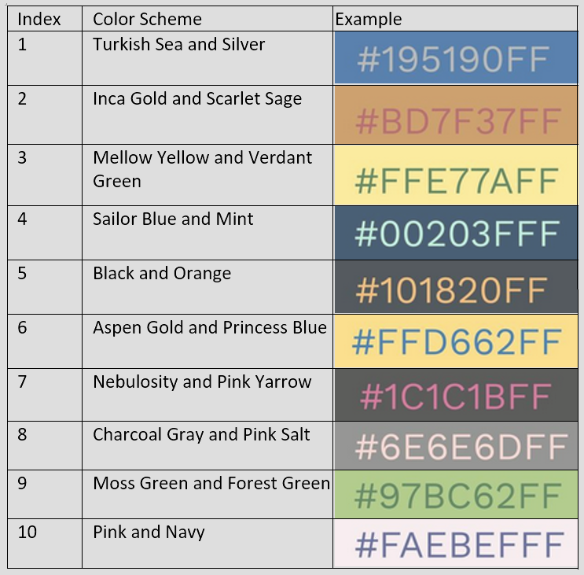

# User Guide

## Introduction

eCardnomics is a **desktop flashcard application to quickly create, manage, and access new flashcards via a Command
 Line Interface (CLI)**. eCardnomics is targeted at economics students in Junior College in Singapore, and aims to
 enhance students’ study experience as an efficient and handy aid for active recall. Through the ability to create
 multiple decks of flashcards and tag them independently, students can segment the subject syllabus into topics when
 managing flashcards, yet consolidate flashcards by topic when accessing them to study.

## Contents

- [Preliminaries](#preliminaries)
  * [Installation](#installation)
  * [Running the program](#running-the-program)
  * [Guide format](#guide-format)
- [Features - Normal Mode](#features---normal-mode)
  * [Viewing help in Normal Mode: `help`](#viewing-help-in-normal-mode---help-)
    + [Examples](#examples)
  * [Create a new deck: `create`](#create-a-new-deck---create-)
    + [Format](#format)
    + [Examples](#examples-1)
  * [Tag an existing deck: `tag`](#tag-an-existing-deck---tag-)
    + [Format](#format-1)
    + [Examples](#examples-2)
  * [Untag an existing tag: `untag`](#untag-an-existing-tag---untag-)
    + [Format](#format-2)
    + [Examples](#examples-3)
  * [Search decks by tag: `search`](#search-decks-by-tag---search-)
    + [Format](#format-3)
    + [Examples:](#examples-)
  * [Display all decks: `decks`](#display-all-decks---decks-)
    + [Format](#format-4)
    + [Examples](#examples-4)
  * [Delete an existing deck: `delete`](#delete-an-existing-deck---delete-)
    + [Format](#format-5)
    + [Examples](#examples-5)
  * [Deck Mode: `edit`](#deck-mode---edit-)
    + [Format](#format-6)
    + [Examples](#examples-6)
  * [Game Mode: `start`](#game-mode---start-)
    + [Format](#format-7)
    + [Examples](#examples-7)
  * [Print an Existing Deck to a PowerPoint File: `pptx`](#print-an-existing-deck-to-a-powerpoint-file---pptx-)
    + [Colors for background and text options](#colors-for-background-and-text-options)
    + [Format](#format-8)
    + [Examples](#examples-8)
- [Features - Deck Mode](#features---deck-mode)
  * [Viewing help in Deck Mode: `help`](#viewing-help-in-deck-mode---help-)
    + [Examples](#examples-9)
  * [Add a flashcard: `add`](#add-a-flashcard---add-)
    + [Format](#format-9)
    + [Examples](#examples-10)
  * [List all the flashcards in the deck: `list`](#list-all-the-flashcards-in-the-deck---list-)
    + [Format](#format-10)
    + [Examples](#examples-11)
  * [Delete an existing Flash Card: `delete`](#delete-an-existing-flash-card---delete-)
    + [Format](#format-11)
    + [Examples](#examples-12)
  * [Update an existing Flash Card: `update`](#update-an-existing-flash-card---update-)
    + [Format](#format-12)
    + [Examples](#examples-13)
  * [Game Mode: `start`](#game-mode---start--1)
    + [Format](#format-13)
    + [Examples](#examples-14)
  * [Print Current Deck to a PowerPoint File: `pptx`](#print-current-deck-to-a-powerpoint-file---pptx-)
    + [Colors for background and text options](#colors-for-background-and-text-options-1)
    + [Format](#format-14)
    + [Examples](#examples-15)
  * [Exits Deck Mode: `done`](#exits-deck-mode---done-)
    + [Examples](#examples-16)
- [Features - Game Mode](#features---game-mode)
  * [Gameplay](#gameplay)
    + [Examples](#examples-17)
  * [Viewing help in Game Mode: `help`](#viewing-help-in-game-mode---help-)
    + [Examples](#examples-18)
  * [Exits Game Mode: `done`](#exits-game-mode---done-)
    + [Examples](#examples-19)
- [Features - Print to PowerPoint](#features---print-to-powerpoint)
  * [Create new PowerPoint based on the selected deck: `pptx`](#create-new-powerpoint-based-on-the-selected-deck---pptx-)
    + [Example](#example)
      - [Output](#output)
    + [Default Color Schemes](#default-color-schemes)
    + [Original Colors available](#original-colors-available)
- [Features - Anywhere](#features---anywhere)
  * [Exits the program: `exit`](#exits-the-program---exit-)
    + [Examples](#examples-20)
  * [Shows release version: `--version`](#shows-release-version-----version-)
    + [Examples](#examples-21)
- [FAQ](#faq)
  * [General](#general)
  * [Storage](#storage)
  * [Normal Mode](#normal-mode)
  * [Deck Mode](#deck-mode)
  * [Game Mode](#game-mode)
- [Command Summary](#command-summary)
  * [Normal Mode](#normal-mode-1)
  * [Deck Mode](#deck-mode-1)
  * [Game Mode](#game-mode-1)
  * [Anywhere](#anywhere)

## Preliminaries

### Installation

1. Ensure that you have Java 11 or above installed.
2. Download the latest _jar_ release of `eCardnomics` from [here](https://github.com/AY2021S1-CS2113-T14
-2/tp/releases).

> Java 11 and above is highly recommended, although eCardnomics might run on a lower version.

<!-- @@author zhixiangteoh -->

### Running the program

Open your command line or terminal and navigate to the folder (e.g., `~/downloads`) where you downloaded the jar file
. Before executing the jar file, create a new folder (e.g., `/ecardnomics`) and copy the jar file to the new folder
. Terminal commands are given below; feel free to use them as appropriate. After doing this, simply run the command
 `java -jar ecardnomics.jar`:

```batch
$ cd ~/downloads
$ ls 
ecardnomics.jar
$ mkdir ./ecardnomics
$ mv ecardnomics.jar ./ecardnomics
$ cd ./ecardnomics
$ ls
ecardnomics.jar
$ java -jar ecardnomics.jar
```

> Note: The terminal commands don't include the `$` sign!

<!-- @@author -->

### Guide format

Words in `<>` are parameters or additional input to be supplied by the user. 

> Example: `edit <index>`
> 
> Here, `index` is a parameter supplied by the user, in this case to specify a deck index to enter edit mode for.

Commented-out lines `//` represent system output by the program.

> Example:
> ```java
> add
> // Enter question: <question description>
> // Enter answer: <question answer or explanation>
> ```
> Notice how `<question description>` is still commented out but still represents user input. In other words
>, `<>` can be thought of as being delimiters in output representation across this guide.

Words in square brackets `[]` represent optional input parameters.

> Example: list [/ans]

## Features - Normal Mode

> `[Normal]` is displayed at every command prompt, to indicate that the program is in Normal Mode.

### Viewing help in Normal Mode: `help`

Displays the list of all commands in Normal Mode. 

#### Examples

```java
[Normal]
  > help
// --------------------------------------------------------------------------------
// eCardnomics.
// Normal Mode.
// 
// Usage:
//   create <nm>   [/tag <tag1> [<tag2> ...]]     Creates a new deck of flash cards
//                                                  named <nm>.                    
//   decks                                        Lists all available decks.       
//   edit   <ix>                                  Enter Deck Mode for editing the  
//                                                  deck at list index <ix>.       
//   start  <ix>                                  Enter Game Mode for deck at list 
//                                                  index <ix>! Do your best!      
//   delete <ix>   [-y]                           Deletes the deck at list index   
//                                                  <ix> from list of decks.       
//   pptx   <ix>   [-y] [-cs <index> | -oc        Creates a PowerPoint slides based
//                  <bg color> <txt color>]         on the deck at list index <ix>.
//   tag    <ix>   /tag <tag1> [<tag2> ...]       Tags the deck at list index <ix> 
//                                                  with 1 or more tags.           
//   untag  <ix>   /tag <tag1> [<tag2> ...]       Untags specified <tag>s of the   
//                                                  deck at list index <ix>.       
//   search <tag1> [<tag2> ...]                   Search deck list for decks tagged
//                                                  with specified <tag>s.         
//   exit                                         Exits the program.
//   help                                         Show this output.
// 
// Options:
//   --version                                    Show version.
// --------------------------------------------------------------------------------
```

### Create a new deck: `create`

Creates a new deck of flashcards. The `create` command expects one argument specifying the name of the deck to be
 created.

#### Format

Create deck without tags:
```java
create <name of deck>
```
> Note: Duplicate deck name will not be allowed. And deck name cannot contain "/tag".

Create deck with tag(s):
```java
create <name of deck> [/tag <tag1> [<tag2>]]
```
> Tags' name must be a single word, spaces are used to separate different tags.
>  Tags' name is case-sensitive and cannot be duplicated.

#### Examples

Create deck without tags:
```java
[Normal]
  > create market-failure
// New deck created: market-failure
```

Create deck with tags:
```java
[Normal]
  > create market-failure /tag beginner advanced
// New deck created: market-failure #Tag: beginner | advanced
```

### Tag an existing deck: `tag`

Adds a tag to an existing deck of flashcards. The `tag` command expects one argument specifying the name of the deck
 to tag. At least one additional argument after /tag specifies tags to be added to the deck.

#### Format

```java
tag <index of deck> /tag <tag1> [<tag2>]
```
> Note: Do `decks` command first to obtain up-to-date index. 
>  Tags' name must be a single word, spaces are used to separate different tags.
>  Tags' name is case-sensitive and cannot be duplicated.

#### Examples

```java
[Normal]
  > tag 1 /tag beginner
// The deck market-failure has been tagged as: beginner
```
```java
[Normal]
  > tag 1 /tag beginner advanced
// The deck market-failure has been tagged as: beginner | advanced
```

### Untag an existing tag: `untag`

Removes an existing tag from an existing deck of flashcards. The `untag` command expects one argument specifying the 
name of the deck to remove a deck from. At least one additional argument after /tag specifies tags 
to be removed from the deck. User is then further prompted for an input of only either `y` or `n`.

#### Format

```java
untag <index of deck> /tag <tag1> [<tag2>]
// Do you want to remove the tag <tag1> from <name of deck>? [y/n] y/n
```
> Note: Do `decks` command first to obtain up-to-date index.
>  Tags' name must be a single word, spaces are used to separate different tags.
>  Tags' name is case-sensitive.

One-line untag command:

```java
untag <index of deck> /tag <tag1> [<tag2>] [-y]
```
> Specify -y for confirmation directly. 
>  To delete an existing -y tag in a deck, type -y twice

#### Examples

```java
[Normal]
  > untag 1 /tag beginner
// Do you want to remove the tag beginner from market-failure? [y/n] y/n
// The tag beginner has been removed from the deck market-failure.
```
```java
[Normal]
  > untag 1 /tag -y -y
// The tag -y has been removed from the deck market-failure.
```

### Search decks by tag: `search`

Searches all the decks containing the specified tags. The `search` command expects at least one argument specifying one 
or more similar tags related to the deck. 

#### Format

```java
search <tag1> [<tag2>]
```
> Note: tags in search command are case-insensitive and must be a single word.
>  Spaces are used to separate different tags.

#### Examples:

```java
[Normal]
  > search Economics
//The decks having tags you are searching for:
//1. Micro-Economics
//   Tags: Economics | EC1301
//2. Macro-Economics
//   Tags: Economics | EC1301
```

> Notice how the original deck index is displayed.

### Display all decks: `decks`

Displays an enumerated list of all the decks available to the user. The `decks` command does not expect any arguments.

#### Format

```java
decks
```
> Note: The program will ignore any input following the command separated by spaces.

#### Examples

```java
[Normal]
  > decks
//The following decks are available:
//1. Micro-Economics
//   Tags: Economics | EC1301
//2. Macro-Economics
//   Tags: Economics | EC1301
```

```java
[Normal]
  > decks thisWillBeIgnored
//The following decks are available:
//1. Micro-Economics
//   Tags: Economics | EC1301
//2. Macro-Economics
//   Tags: Economics | EC1301
```

### Delete an existing deck: `delete`

Deletes an existing deck of flashcards. The `delete` command expects one argument specifying the index of the deck to
 be deleted. User is then further prompted for an input of only either `y` or `n`.
 
#### Format

```java
[Normal]
  > delete <index of deck> [-y]
// Do you want to delete `name of deck`? [y/n] <y/n>
// `name of deck` has been deleted.
```

> Note: `name of deck` is a placeholder for the actual name of the deck corresponding to the index entered. The second
> line will only be displayed if the user entered y at the prompt for <y/n>.

One-line format:
```
  > delete <index of deck> -y
```
This command forces the delete of the deck at index `<index of deck>`.

#### Examples

Deciding not to delete:
```java
[Normal]
  > delete 1
// Do you want to delete market-failure? [y/n] n
[Normal]
  > 
```

Confirming a delete:
```java
[Normal]
  > delete 2
// Do you want to delete perfect competition? [y/n] y
// perfect competition has been deleted.
[Normal]
  >
```

Entering an invalid response:
```java
[Normal]
  > delete 1
// Do you want to delete market-failure? [y/n] no way
// Response should be 'y' or 'n'!
// Do you want to delete market-failure? [y/n] y
// market-failure has been deleted.
[Normal]
  >
```

### Deck Mode: `edit`

Enters the Deck Mode to edit an existing deck. The `edit` command expects one argument specifying the deck index for
 which to enter Deck Mode.
 
#### Format

```java
[Normal]
  > edit <index of deck>
```

#### Examples

```java
[Normal]
  > edit 1
// --------------------------------------------------------------------------------
// You are now in Deck Mode, editing: [1] market-failure
// --------------------------------------------------------------------------------
[Deck - market-failure]
  >
```

> Notice how the prompt mode identifier `[Normal]` changed to `[Deck - market-failure]`.

### Game Mode: `start`

Starts Game Mode for an existing deck. The `start` command expects one argument specifying the deck index for which to
 enter Deck Mode.
 
> The `start` command can also be entered from within Deck Mode, without the need for a deck index.
 
#### Format

```java
[Normal]
  > start <index of deck>
```

#### Examples

```java
[Normal]
  > start 1
// --------------------------------------------------------------------------------
// Welcome to Game Mode!
//
// In this mode, you test your knowledge against...
// ... 
//                                      ...Have fun!
//
// Game Mode is started for: [1] market-failure
// --------------------------------------------------------------------------------
// Q: What is market failure?
//   Enter your attempt below (or `done`, `exit`, `help`):
  >
```

### Print an Existing Deck to a PowerPoint File: `pptx`

Prints an existing deck to a new PowerPoint file named `<deck name>.pptx` in `pptx/` folder.
The `pptx` command expects one argument specifying the deck index for which to enter Deck Mode.
You can add the option `-y` to create the PowerPoint without any further prompt.

#### Colors for background and text options
To select the color for background and text, you can either select from one of the 10 default color schemes
using `-cs <index>` or choose your own background and text colors using `-oc <bg color> <txt color>`. 
You can only choose *either* and **not both** options to select color.
More details about the colors for original colors and color schemes available can be found [below](#features---print-to-powerpoint) 
 
 > The `pptx` command can also be entered from within Deck Mode, without the need for deck index.

#### Format

```java
// --------------------------------------------------------------------------------
[Normal]
  > pptx <index of deck>
// Do you want to print `name of deck` deck to PowerPoint? [y/n] yes
// Response should be 'y' or 'n'!
//   > y
// --------------------------------------------------------------------------------
// 'name of deck' has been created as PowerPoint with default,
//   black background and white text
// --------------------------------------------------------------------------------
```

```java
// --------------------------------------------------------------------------------
[Normal]
  > pptx <index of deck> -y
// --------------------------------------------------------------------------------
// 'name of deck' been created as PowerPoint with default,
//   black background and white text
// --------------------------------------------------------------------------------
```
```java
[Normal]
  > pptx <index of deck> -y -cs <index of cs>
// --------------------------------------------------------------------------------
// Micro-Economics has been created as PowerPoint using Color Scheme,
//   with <bg color> background and <txt color> text
// --------------------------------------------------------------------------------
```

```java
[Normal]
  > pptx <index of deck> -y -oc <bg color> <txt color>
// --------------------------------------------------------------------------------
// Micro-Economics has been created as PowerPoint using Original Colors,
//   with <bg color> background and <txt color> text
// --------------------------------------------------------------------------------
```

#### Examples
```java
[Normal]
  > pptx 1
// Do you want to print `name of deck` deck to PowerPoint? [y/n] yes
// Response should be 'y' or 'n'!
//   > y
// --------------------------------------------------------------------------------
// --------------------------------------------------------------------------------
// Micro-Economics has been created as PowerPoint with default,
//   black background and white text
// --------------------------------------------------------------------------------
```

```java
[Normal]
  > pptx 1 -y
// --------------------------------------------------------------------------------
// Micro-Economics has been created as PowerPoint with default,
//   black background and white text
// --------------------------------------------------------------------------------
```

```java
[Normal]
  > pptx 1 -y -cs 1
// --------------------------------------------------------------------------------
// Micro-Economics has been created as PowerPoint using Color Scheme,
//   with steelblue background and silver text
// --------------------------------------------------------------------------------
```

```java
[Normal]
  > pptx 1 -y -oc lightblue darkred
// --------------------------------------------------------------------------------
// Micro-Economics has been created as PowerPoint using Original Colors,
//   with lightblue background and darkred text
// --------------------------------------------------------------------------------
```

## Features - Deck Mode

### Viewing help in Deck Mode: `help`

Displays the list of all commands in Deck Mode.

#### Examples

```java
[Deck - market-failure]
  > help
// --------------------------------------------------------------------------------
// eCardnomics.
// Deck Mode.
// 
// Usage:
//   add         [<qn> /ans <ans>]           Adds a new flash card to the current  
//                                             deck.                               
//   list        [/ans]                      Lists all flash cards in the current  
//                                             deck, optionally with answers.      
//   delete <ix> [-y]                        Deletes the flash card at list index  
//                                             <ix> from the current deck.
//   update <ix>                             Updates the flash card at list index
//                                             <ix> from the current deck.         
//   pptx        [-y] [-cs <index> | -oc     Creates a PowerPoint slides based on  
//                <bg color> <txt color>]      current deck.                       
//   start                                   Enter Game Mode for this deck! Do your
//                                             best!                               
//   done                                    Exits from Deck Mode and returns to   
//                                             Normal Mode.                        
//   exit                                    Exits the program.                    
//   help                                    Show this output.                     
// 
// Options:
//   --version                               Show version.
// --------------------------------------------------------------------------------
```

### Add a flashcard: `add`
Adds a flashcard to the end of the current deck. The `add` command expects no initial arguments. Instructions and 
format of card entry is displayed. Then, the user is prompted to specify the details of the flashcard to be added.
Duplicate flashcards are allowed. Note that questions and answers must contain at least one alphanumeric character.

#### Format
```java
  > add
// Enter question: <question description>
// Enter answer: <question answer or explanation>
```
 
Equivalent One-line format:
```java
  > add <question description> /ans <question answer or explanation>
```
>The `/ans` option, if supplied, must be separated from the question and answer by spaces.
>
>If `/ans` option is not supplied correctly, `<question description>` is stored and the user is prompted
>for the answer. This includes the case of 'add /ans <some text>' because the question must not be empty and we allow
>'/ans' to be part of a question.

#### Examples

```java
[Deck - market failure]
     > add 
// --------------------------------------------------------------------------------
// You are now adding a FlashCard to: market failure
// --------------------------------------------------------------------------------
// Enter question:
     > define market failure
// Enter answer:
     > Market failure is the economic situation defined by an inefficient distribution of goods 
and services in the free market
// FlashCard successfully added! 
// -------------------------------------------------------------------------------- 
```

### List all the flashcards in the deck: `list`
Lists all the existing flash cards within the current deck. You can add the option `\ans` after the `list` command 
to show all the questions, and their respective answers.

#### Format
```java
[Deck - 'name of deck']
  > list
// --------------------------------------------------------------------------------
// You are now viewing deck: `name of deck`
// --------------------------------------------------------------------------------
// 1. Question: <question 1>
// 
// 2. Question: <question 2>
//
// 3. Question: <question 3>
// --------------------------------------------------------------------------------
```

```java
[Deck - 'name of deck']
  > list /ans
// --------------------------------------------------------------------------------
// You are now viewing deck: 'name of deck'
// --------------------------------------------------------------------------------
// 1. Question: <question 1>
//    Answer:   <answer 1>
//
// 2. Question: <question 2>
//    Answer:   <answer 2>
//
// 3. Question: <question 3>
//    Answer:   <answer 3>
// --------------------------------------------------------------------------------
```

#### Examples
List without answers:
```java
[Deck - market-failure]
  > list
// --------------------------------------------------------------------------------
// You are now viewing deck: market-failure
// --------------------------------------------------------------------------------
// 1. Question: define market failure
//
// 2. Question: What is a public good?
//
// 3. Question: What is a merit good?
// --------------------------------------------------------------------------------
```

List with answers:
```java
[Deck - market-failure]
  > list /ans
// --------------------------------------------------------------------------------
// You are now viewing deck: market-failure
// --------------------------------------------------------------------------------
// 1. Question: define market failure
//    Answer:   Market failure is the economic situation
//              defined by an inefficient distribution of goods
//              and services in the free market
// 
// 2. Question: What is a public good?
//    Answer:   A good which are non-rival and non-excludable
// 
// 3. Question: What is a merit good?
//    Answer:   A good that people underestimates the benefits
//              of
// --------------------------------------------------------------------------------
```

### Delete an existing Flash Card: `delete`

Deletes an existing flashcard from deck. The `delete` command expects one argument specifying the index of the flash card to
 be deleted. User is then further prompted for an input of only either `y` or `n`.
 
#### Format

```java
[Deck - 'name of deck']
  > delete 1
// Do you want to delete the following flash card? [y/n] ?
//   '<question 1>' n
// --------------------------------------------------------------------------------
```

```java
[Deck - 'name of deck']
  > delete 2
// Do you want to delete the following flash card? [y/n] ?
//   '<question 2>' y
// --------------------------------------------------------------------------------
// The following flash card has been deleted:
//   '<question 2>'
// --------------------------------------------------------------------------------
```

> Note: `name of deck` is a placeholder for the name of the current deck. The second
> line will only be displayed if the user entered y at the prompt for <y/n>.

One-line format:
```java
  > delete <index of FlashCard> -y
```
This command forces the delete of the Flashcard at index `<index of FlashCard>`.

#### Examples

Deciding not to delete:
```java
[Deck - market-failure]
  > delete 1
// Do you want to delete the following flash card? [y/n]
//   `define market failure?` n
// --------------------------------------------------------------------------------
[Deck - market-failure]
  > 
```

Confirming a delete:
```java
[Deck - market-failure]
  > delete 2
// Do you want to delete the following flash card? [y/n] ?
//   'What is a public good?' y
// --------------------------------------------------------------------------------
// The following flash card has been deleted:
//   'What is a public good?'
// --------------------------------------------------------------------------------
[Deck - market-failure]
  > 
```

Entering an invalid response:
```java
[Deck - market failure]
  > delete 2
// Do you want to delete the following flash card? [y/n] ?
//   'What is a public good?' definitely
// Response should be 'y' or 'n'!
//   > y
// --------------------------------------------------------------------------------
// The following flash card has been deleted:
//   'What is a public good?'
// --------------------------------------------------------------------------------
```

### Update an existing Flash Card: `update`

Updates the question and answer fields of a  specified flashcard in the deck. The `update` command expects no initial
 arguments. The current question and answer are displayed. Then, the user is prompted to specify the new details of
  the flashcard.

#### Format
```java
[Deck - 'name of deck']
  > update <index of flashcard>
// Question: `Current Question`
// New Question:
    > <new question>
//
// Answer:   `Current Answer`
// New Answer:
    > <new answer>
```
> Note: `name` is a placeholder for the actual name of the deck that is being edited.
> `Current Question` and `Current Answer` are placeholders for the original question
> and answer of the flashcard.

If a blank line is supplied as the new detail, then the detail is unchanged.

If either the new question or new answer is specified without any alphanumeric characters, then both will be rejected
amd the old question and old answer will be retained. 

#### Examples

Updating both the question and answer:
```java
[Deck - market failure]
  > update 1
// Question: Define market failure
// New Question:
  > What is the difference between free-loading and free-riding?
//
// Answer:   Economic situation defined by inefficient distribution of goods and services in the free market
// New Answer:
  > Free-loading gives a benefit to the free-loader but there is a cost to the people taken advantage of.
    Free-riding is an advantage to the free-rider without imposing a cost on others or society.
// --------------------------------------------------------------------------------
// Question and answer updated.
// --------------------------------------------------------------------------------
```

Updating question only:
```java
[Deck - market failure]
  > update 1
// Question: Define market failure
// New Question:
  > Define Market Failure
//
// Answer:   Economic situation defined by inefficient distribution of goods and services in the free market
// New Answer:
  > 
// --------------------------------------------------------------------------------
// Question updated.
// --------------------------------------------------------------------------------
```

Updating answer only:
```java
[Deck - market failure]
  > update 1
// Question: Define market failure
// New Question:
  > 
//
// Answer:   Economic situation defined by inefficient distribution of goods and services in the free market
// New Answer: Economic situation where distribution of goods and services in the free market is inefficient
  > Economic situation where distribution of goods and services in the free market is inefficient
// --------------------------------------------------------------------------------
// Answer updated.
// --------------------------------------------------------------------------------
```

No updates:
```java
[Deck - market failure]
  > update 1
// Question: Define market failure
// New Question:
  > 
//
// Answer:   Economic situation defined by inefficient distribution of goods and services in the free market
// New Answer: Economic situation where distribution of goods and services in the free market is inefficient
  > 
// --------------------------------------------------------------------------------
// Original question and answer retained.
// --------------------------------------------------------------------------------
```

### Game Mode: `start`

Starts Game Mode for the current deck. Upon completion of Game Mode, user is returned to Normal Mode.

> The `start` command can also be entered from within Normal Mode.
>
> Note: typing `done` in Game Mode returns user to Normal Mode, regardless of which mode Game Mode was started from
>. See [Game Mode `done`](#exits-game-mode-done).
 
#### Format

```java
[Deck - market-failure]
  > start
```

#### Examples

```java
// You are now in Deck Mode, editing: [1] market-failure
// --------------------------------------------------------------------------------
[Deck - market-failure]
  > ...
// ...
// --------------------------------------------------------------------------------
[Deck - market-failure]
  > start
// --------------------------------------------------------------------------------
// Welcome to Game Mode!
//
// In this mode, you test your knowledge against...
// ... 
//                                      ...Have fun!
//
// Game Mode is started for: [1] market-failure
// --------------------------------------------------------------------------------
// Q: What is market failure?
//   Enter your attempt below (or `done`, `exit`, `help`):
  >
```

### Print Current Deck to a PowerPoint File: `pptx`

Prints the current deck to a new PowerPoint file named `<deck name>.pptx` in `pptx/` folder.
You can add the option `-y` to create the PowerPoint without any further prompt.

#### Colors for background and text options
To select the color for background and text, you can either select from one of the 10 default color schemes
using `-cs <index>` or choose your own background and text colors using `-oc <bg color> <txt color>`. 
You can only choose *either* and **not both** options to select color.
More details about the colors for original colors and color schemes available can be found [below](#features---print-to-powerpoint)

> The `pptx` command can also be entered from within Normal Mode.
 
#### Format
```java
[Deck - 'name of deck']
  > pptx
// Do you want to print 'name of deck' deck to PowerPoint? [y/n] yes
// Response should be 'y' or 'n'!
//   > y
// --------------------------------------------------------------------------------
// 'name of deck' has been created as PowerPoint with default,
//   black background and white text
// --------------------------------------------------------------------------------
```

```java
[Deck - 'name of deck']
  > pptx -y
// --------------------------------------------------------------------------------
// 'name of deck' been created as PowerPoint with default,
//   black background and white text
// --------------------------------------------------------------------------------
```

```java
[Deck - 'name of deck']
  > pptx -y -cs <index of cs>
// --------------------------------------------------------------------------------
// Micro-Economics has been created as PowerPoint using Color Scheme,
//   with <bg color> background and <txt color> text
// --------------------------------------------------------------------------------
```

```java
[Deck - 'name of deck']
  > pptx -y -oc <bg color> <txt color>
// --------------------------------------------------------------------------------
// Micro-Economics has been created as PowerPoint using Original Colors,
//   with <bg color> background and <txt color> text
// --------------------------------------------------------------------------------
```

#### Examples

```java
[Deck - Micro-Economics]
  > pptx 
// Do you want to print Micro-Economics deck to PowerPoint? [y/n] y
// --------------------------------------------------------------------------------
// Micro-Economics has been created as PowerPoint with default,
//   black background and white text.
// --------------------------------------------------------------------------------
```

```java
[Deck - Micro-Economics]
  > pptx -y
// --------------------------------------------------------------------------------
// Micro-Economics has been created as PowerPoint with default,
//   black background and white text.
// --------------------------------------------------------------------------------
```

```java
[Deck - Micro-Economics]
  > pptx -y -cs 1
// --------------------------------------------------------------------------------
// Micro-Economics has been created as PowerPoint using Color Scheme,
//   with steelblue background and silver text.
// --------------------------------------------------------------------------------
```

```java
[Deck - Micro-Economics]
  > pptx -y -oc lightblue darkred
// --------------------------------------------------------------------------------
// Micro-Economics has been created as PowerPoint using Original Colors,
//   with lightblue background and darkred text.
// --------------------------------------------------------------------------------
```

### Exits Deck Mode: `done`

Returns to Normal Mode.

#### Examples

```java
[Deck - market-failure]
  > done
// --------------------------------------------------------------------------------
// You are back in Normal Mode
// --------------------------------------------------------------------------------
[Normal]
  >
```

## Features - Game Mode

### Gameplay

Questions are displayed in a randomised order. At each question, the user will:

1. Try to attempt an answer at the question, by typing at the prompt; then
2. Press `<enter>` (optionally with an empty attempt).

Then, the correct answer is displayed, and our 'advanced' algorithm scores the user's attempt against the correct
 answer. Finally, the user is given the option to re-attempt the question later. See below for example gamplay.

> Upon completion of deck in Game Mode, user is always returned to **Normal Mode**.

#### Examples

* Start Game Mode (from within Deck Mode)

```java
[Deck - Micro-Economics]
  > list
// --------------------------------------------------------------------------------
// You are now viewing deck: Micro-Economics
// 1. Question: What is the Law of demand?
// 
// 2. Question: What is the Law of supply?
//
// 3. Question: What is price elasticity of demand?
//
// 4. Question: What is price elasticity of supply?
// --------------------------------------------------------------------------------
[Deck - Micro-Economics]
  > start
```

* Play!

```java
// ...
// Game Mode is started for: [1] Micro-Economics
// --------------------------------------------------------------------------------
// Q: What is the Law of supply?
//   Enter your attempt below (or `done`, `exit`, `help`):
   > Price of good increases, quantity supplied increases.
// A: When the price of a good increases, the quantity supplied increases, ceteris paribus.
// The % match between your answer and the actual answer is: 53.85
// --------------------------------------------------------------------------------
// Do you want to re-attempt this question later? [y/n]
  > y
// --------------------------------------------------------------------------------
// Q: What is price elasticity of demand?
//   Enter your attempt below (or `done`, `exit`, `help`):
  > I don't know.
// A: Percentage change in quantity demanded caused by a 1 percent change in price.
// The % match between your answer and the actual answer is: 0.00
// --------------------------------------------------------------------------------
// Do you want to re-attempt this question later? [y/n]
  > y
// --------------------------------------------------------------------------------
// Q: What is the Law of demand?
//   Enter your attempt below (or `done`, `exit`, `help`):
  > Quantity of good demanded fall when price of good rises.
// A: When the price of a good rises, the quantity of the good demanded will fall, ceteris paribus.
// The % match between your answer and the actual answer is: 58.82
// --------------------------------------------------------------------------------
// Do you want to re-attempt this question later? [y/n]
  > n
// --------------------------------------------------------------------------------
// Q: What is price elasticity of supply?
//   Enter your attempt below (or `done`, `exit`, `help`):
  > Percentage change in quantity supplied for a 1 percent price change
// A: Percentage change in quantity supplied caused by a 1 percent change in price.
// The % match between your answer and the actual answer is: 84.62
// --------------------------------------------------------------------------------
// Do you want to re-attempt this question later? [y/n]
  > n
// --------------------------------------------------------------------------------
// Q: What is price elasticity of demand?
//   Enter your attempt below (or `done`, `exit`, `help`):
  > Percentage change in quantity demanded for a 1 percent price change.
// A: Percentage change in quantity demanded caused by a 1 percent change in price.
// The % match between your answer and the actual answer is: 84.62
// --------------------------------------------------------------------------------
// Do you want to re-attempt this question later? [y/n]
  > n
// --------------------------------------------------------------------------------
// Q: What is the Law of supply?
//   Enter your attempt below (or `done`, `exit`, `help`):
  > Price of a good increases, the quantity supplied increases, ceteris paribus.
// A: When the price of a good increases, the quantity supplied increases, ceteris paribus.
// The % match between your answer and the actual answer is: 92.31
// --------------------------------------------------------------------------------
// Do you want to re-attempt this question later? [y/n]
  > n
// --------------------------------------------------------------------------------
// You have completed all the flash cards in this deck!
// Returning to Normal Mode...
// --------------------------------------------------------------------------------
// You are back in Normal Mode
// --------------------------------------------------------------------------------
[Normal]
  >
```

### Viewing help in Game Mode: `help`

Displays the list of all commands in Game Mode.

#### Examples

```java
// ...
// --------------------------------------------------------------------------------
// Q: What is market-failure?
//   Enter your attempt below (or `done`, `exit`, `help`):
  > help
// --------------------------------------------------------------------------------
// eCardnomics.
// Game Mode.
// 
// Usage:
//   done           Exits from Game Mode and returns to Normal Mode.
//   exit           Exits the program.
//   help           Show this output.
// 
// Options:
//   --version      Show version.
// 
// Gameplay:
// Questions will be displayed in a randomised order. At each question, you can
//     1. Try to attempt an answer at the question, by typing at the prompt
//     2. Press <enter> (with an empty attempt if you want to do it in your head)
// 
// Then, our 'advanced' algorithms will check your answer and score your answer (if
// any), and display the correct answer for you to check your answer against.
// Finally, we will ask if you think you got it right. If you did not, the question
// will be inserted back into the question pool, and you will get a chance to
// attempt it again!
// --------------------------------------------------------------------------------
// Q: What is market-failure?
//   Enter your attempt below (or `done`, `exit`, `help`):
  > 
```

### Exits Game Mode: `done`

Returns to Normal Mode.

#### Examples

```java
// ...
// --------------------------------------------------------------------------------
// Q: What is market-failure?
//   Enter your attempt below (or `done`, `exit`, `help`):
  > done
// --------------------------------------------------------------------------------
// You are back in Normal Mode
// --------------------------------------------------------------------------------
[Normal]
  > 
```

## Features - Print to PowerPoint

### Create new PowerPoint based on the selected deck: `pptx`

Can be done from both Normal Mode and Deck Mode. In Normal Mode, a deck index is required, 
but in Deck Mode, there is no need to specify the deck index.
Has the option to skip confirmation prompt using `-y` suffix.
There is also the option to select both the background and text colors. There are 10 default color schemes that the 
user can choose from using the option `-cs 1`. [See below for the default color schemes](#default-color-schemes)
There is also the option to choose your own colors for background and text from the provided colors using the option
`-oc <bg color> <txt color>`. [See below for the colors available](#original-colors-available)

#### Example
The following is an example of the slides printed out after the following command.
```java
[Deck - Micro-Economics]
  > pptx -y -cs 1
// --------------------------------------------------------------------------------
// Micro-Economics has been created as PowerPoint using Color Scheme,
//   with steelblue background and silver text.
// --------------------------------------------------------------------------------
```

##### Output


For details, check out:

* [Normal Mode PowerPoint](#print-an-existing-deck-to-a-powerpoint-file-pptx)
* [Deck Mode PowerPoint](#print-current-deck-to-a-powerpoint-file-pptx)

#### Default Color Schemes
The following is the default schemes that are available and their respective index.


#### Original Colors available
Some of the colors include:
* Red
* Blue
* Yellow
* Green
* Black
* White
* Purple
* Violet
* Pink 
* Navy
* Gray

The complete list of colors can be found [here](https://www.javadoc.io/doc/org.beryx/awt-color-factory/1.0.1/org.beryx.awt.color/org/beryx/awt/color/ColorFactory.html)

## Features - Anywhere

### Exits the program: `exit`

Can be entered from any mode, anywhere in the program.

> Except during Y/N prompts.

#### Examples

```java
[Normal]
  > exit
// --------------------------------------------------------------------------------
// Bye! Hope to see you again soon!
// --------------------------------------------------------------------------------
```

```java
[Deck - market-failure]
  > exit
// --------------------------------------------------------------------------------
// Bye! Hope to see you again soon!
// --------------------------------------------------------------------------------
```

```java
...
// --------------------------------------------------------------------------------
// Q: What is market-failure?
//   Enter your attempt below (or `done`, `exit`, `help`):
  > exit
// --------------------------------------------------------------------------------
// Bye! Hope to see you again soon!
// --------------------------------------------------------------------------------
```

### Shows release version: `--version`

Shows release version from anywhere in the program.

> Except during Y/N prompts.

#### Examples

```java
// ...
// --------------------------------------------------------------------------------
// Q: What is market-failure?
//   Enter your attempt below (or `done`, `exit`, `help`):
  > --version
// --------------------------------------------------------------------------------
// Version: 2.0
// --------------------------------------------------------------------------------
// Q: What is market-failure?
//   Enter your attempt below (or `done`, `exit`, `help`):
  > 
```

## FAQ

### General
**Q**: With none-argument command, can it be executed if I type the command with some nonsense
arguments?
**Q**: Yes you still can, with this type of command, such as exit or done, the program will only take 
into account the first word you enter, the rest will be automatically discarded.

Example:
```java
[Deck - Macro-Economics]
  > done cdcns cndcn
//--------------------------------------------------------------------------------
//You are back in Normal Mode
//--------------------------------------------------------------------------------
```
**A**: No. You cannot name your deck with "/tag" word. However, the tag of deck can
contain "/tag".

**Q**: Why are some of the output (e.g. questions and answer) aligned to the dashed lines but not others (like help).

**A**: Question and answers could possibly be very long and could take up multiple lines. These are also important
information that the economics students are trying to study. We would not want an inconsistent wrapping scheme
distracting users from focusing on the contents of the flashcards. For other output with fixed lengths that
slightly exceed the dashed lines, the readability is not really affected and one could even say that having all
the information on a single line is more readable.

**Q**: Help command can be typed anywhere but is not found in the "Anywhere" section of this document. Why?

**A**:  Anywhere section is for generic commands that have same effect regardless of user's location within
application. help commands are unique and distinct across different modes, which explains the decision to place
it within each mode, rather than within the "Anywhere" section.

### Storage

**Q**: Can I edit the save file directly to add or remove flashcards and decks?

**A**: Yes, you can! However, there are some constraints when it comes to the format of the txt data file.

Each deck of flashcards should be written in the following format:

```java
================================================================================
deck | <nameOfDeck>
tags | <tags> | <moreTags> | <evenMoreTags>
Q | <questionStatement>
A | <answerStatement>
Q | <anotherQuestionStatement>
A | <anotherAnswerStatement>
================================================================================
```

Note:
* Each **`Deck`** should be separated by a line of '=' shown above.
* Each item must be specified with the delimiter " | " with whitespaces on each side.
* More `tags` are separated by the delimiter " | " as well.
* **`Decks`** with duplicate deck names will be removed when starting the program.
* `Questions` and `Answers` cannot be blank and must contain alphanumeric characters.
* **Should there be any deviance from the specified format, 
the entire deck with deviant formatting will be lost when starting the program.**


### Normal Mode

**Q**: Can the deck name contain "/tag"?

**A**: No. You cannot name your deck with "/tag" word. However, the tag of deck can
contain "/tag".

### Deck Mode

**Q**: Can my answer contain "/ans"?

**A**: Yes, just type it in the same way as any other one-line add command:

```java
> add My Question /ans /ans
```
Alternatively, `add` and `add My Question` also work since the answer will be read separately.

**Q**: Can my question contain "/ans"?

**A**: Yes. If it is part of another word:
```java
> add What is sum/ans? /ans some value
```
Otherwise, use `add` without any arguments so that the question is read separately.

**Q**: Why is a single line update command not provided?

**A**: When updating the information on a flashcard, it is important to view the previous contents of the flashcard
to determine the correct new information to update the flashcard. Therefore, it is unlikely that there will be a
useful scenario for a single line update command.

### Game Mode

**Q**: What if my flash card answer contains a single word "done" or "exit"?

```java
// Q: What is the command to exit Game Mode or Deck Mode?
//   Enter your attempt below (or `done`, `exit`, or `help`):
  > done
// --------------------------------------------------------------------------------
// You are back in Normal Mode
// --------------------------------------------------------------------------------
[Normal]
  >
```

**A**: Escape the command using punctuations, e.g. `\done` or `"done"`.

```java
// Q: What is the command to exit Game Mode or Deck Mode?
//   Enter your attempt below (or `done`, `exit`, or `help`):
  > "done"
// A: done
// The % match between your answer and the actual answer is: 100.00
// --------------------------------------------------------------------------------
// ...
```

## Command Summary

### Normal Mode

|Action|Format|Example|
|------|------|-------|
|Create deck|`create <nm>`|`create market-failure`|
|Tag deck|`tag <ix> /tag <tag1> [<tag2> ...]`|`tag 1 /tag important final-exam`|
|Untag deck|`untag <ix> /tag <tag1> [<tag2> ...] [-y]`|`untag 1 /tag important`|
|Search by tag(s)|`search <tag1> [<tag2> ...]`|`search final-exam important`|
|Display decks|`decks`||
|Delete deck|`delete <ix> [-y]`|`delete 1`|
|Enter Deck Mode|`edit <ix>`|`edit 1`|
|Enter Game Mode|`start <ix>`|`start 1`|
|Create PowerPoint|`pptx <ix> [-y] [-oc <bg color> <txt color>] [-cs <cs index>]`|`pptx 1`|
|Help|`help`||

### Deck Mode

|Action|Format|Example|
|------|------|-------|
|Add flash card|`add [<qn> /ans <ans>]`||
|List flash cards|`list [/ans]`||
|Delete flash card|`delete <ix> [-y]`|`delete 1`|
|Update flash card|`update <ix>`|`update 1`|
|Enter Game Mode|`start`||
|Create PowerPoint|`pptx [-y]`||
|Exit Deck Mode|`done`||
|Help|`help`||

### Game Mode

|Action|Format|Example|
|------|------|-------|
|Done|`done`||
|Help|`help`||

### Anywhere

|Action|Format|Example|
|------|------|-------|
|Exit program|`exit`||
|Show version|`--version`||
