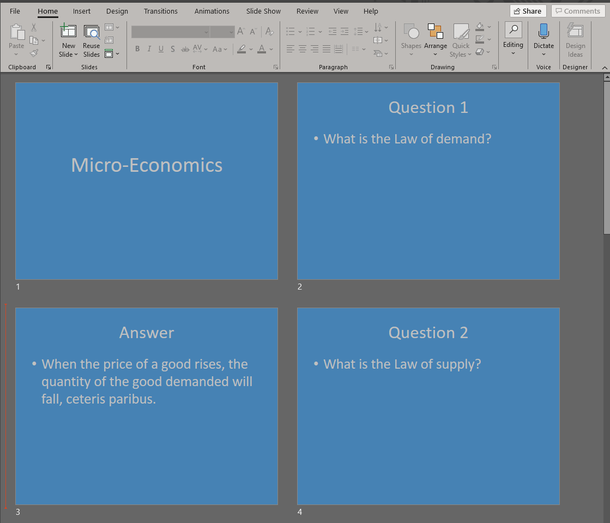

# Liau Kai Jie - Project Portfolio Page

## Overview
eCardnomics is a complete Command Line Interface Flash Card manager program for fast-typing, Junior College Economics 
students to create flash cards. The manager can store multiple decks of flash cards, which consists of a question and an 
answer, and has 3 distinct modes of operation.

In Normal mode, it can manage decks of flash card performing operations such as `create`, `delete`, `tag`, `search` and 
`ppt` on a particular deck. 

There is also Deck mode which can accessed from Normal mode via the operation `edit` which allows the user to edit the 
flash cards within a deck by performing operations such as `add`, `delete` and `update`. 

The last mode is Game mode which is the main tool that the users will be using after they have created a deck to help them 
with their studying by practicing active recall. 

### Summary of Contributions
#### Code Contributed 
My code contribution can be found [here](https://nus-cs2113-ay2021s1.github.io/tp-dashboard/#breakdown=true&search=kaijiel24&sort=groupTitle&sortWithin=title&since=2020-09-27&timeframe=commit&mergegroup=&groupSelect=groupByRepos&checkedFileTypes=docs~functional-code~test-code~other)
#### Basic features implemented:
##### v1.0:
* Run Normal mode and run Deck mode in Main
* Normal Parser and Deck Parser
* Edit command to enter Deck mode from Normal mode
* Exit command from both Normal and Deck mode
* Done Edit command to return to Normal mode from Deck mode
* Getting index from user input to be used in commands which require an index (such as `delete`, `edit`,`tag`)
    * Handling Exceptions for user input index 
        * If the argument given is not a positive integer (-1, micro-economics, or random etc...), `IndexFormatException`
            will be thrown.
        * If the number given is too big such that it is greater than MAX_INT and cannot be stored in an integer variable,
            `NumberTooBigException` will be thrown.
        * If the number given is not within the range of number of decks/ flash cards (either 0 or greater than number
            of decks/ flash cards), `DeckRangeException`/ `FlashCardRangeException` will be thrown.
            
#### Enhancements implemented:
The following are the enhancements I have implemented categorised by the versions of the program.

##### v2.0
* Powerpoint command 
    * This feature allows the user to print any deck to a PowerPoint Slide (.pptx file) within the pptx folder of the 
        current working directory.
    * The target for this could be students who wish to use the flash cards they have created on other platforms such
        their mobile phones or test themselves outside of the CLI. 
    * This command can be called from both Normal mode (need to specify which deck to use) and Deck mode (do not 
        need to specify, automatically uses the current deck).
    * The PowerPoint Slide is created using the [`Apache POI API`](https://poi.apache.org/index.html).
  
    * Added [JUnit Test](https://github.com/AY2021S1-CS2113-T14-2/tp/commit/5c398c4b666efb7719c83f83513d797c8cbccdd6) 
        for these functionalities
    
* 'Force Yes' option for commands that have prompt for confirmation (such as `delete` and `pptx`)
    * This feature allows fast-typist to directly enter a one-line command by adding the option `-y` after the commands
        to by pass the prompt, and to be more efficient in their use of the program.
        
##### v2.1
* Powerpoint command choose text and background color

    
    
    *Example of PowerPoint Slide with steelblue background and silver text created using the `-cs` option*
    
    * Added two options to `pptx` command that allows user to choose their preferred background and text color for the 
        PowerPoint slides that are created. 
        * The options use [`Color Factory API`](https://github.com/beryx/awt-color-factory) which converts a
            String that has the value of a valid string to a `Color` object.
        * The description of the option can be found in the [User Guide](../UserGuide.md#features---print-to-powerpoint).
        * The description of the implementation can be found in the [Developer Guide](../DeveloperGuide.md#print-to-powerpoint-slideshow)
        * Default *Color Schemes* `-cs` 
            * There are exceptions thrown if the index is either not within the range [1,10], `CsIndexRangeException` or 
                not in the correct format, `CsIndexFormatException`.
        * *Original Color* selection `-oc`
            * There is an exception thrown, `ColorsNotAvailException` when the at least one of the colors chosen is not 
                a valid color.
        
    * In each command, only either of the options can be used to select the colors so if both options are included 
        at the same time, there will be an exception thrown, `BothCsAndOcException`.
    * Any other options entered starting with `-` will trigger the exception, `InvalidOptionException`.
    * In Deck Mode if any other arguments other than the 3 options are present, the exception, `InvalidPptxArgumentException`
        will be thrown.
    
    * Added [JUnit Test](https://github.com/AY2021S1-CS2113-T14-2/tp/commit/1b123da1bad272b58964e89d6fefb2062b08d7d4) 
        for these functionalities
    
#### Contributions to documentation:
In the User Guide, I wrote the following sections 
* [Normal Mode - Print to PowerPoint](../UserGuide.md#print-an-existing-deck-to-a-powerpoint-file-pptx)
* [Deck Mode - Print to PowerPoint](../UserGuide.md#print-current-deck-to-a-powerpoint-file-pptx)
* [Features - Print to PowerPoint](../UserGuide.md#features---print-to-powerpoint)
    * [Print to PowerPoint - Default Color Schemes](../UserGuide.md#default-color-schemes)
    * [Print to PowerPoint - Original Colors available](../UserGuide.md#original-colors-available)
* [Command Summary - `pptx`](../UserGuide.md#command-summary)

#### Contributions to the DG:
* [Architecture](../DeveloperGuide.md#application-architecture)
* [Exceptions](../DeveloperGuide.md#exceptions)
    * Added the `NumberTooBigException` and all the exceptions for `getCsIndex()` and `preparePptxIndex()`
* [Print to PowerPoint SlideShow](../DeveloperGuide.md#print-to-powerpoint-slideshow)
    * Added the [sequence diagram](../images-dg/PPTX-Sequence-Diagram.png) and explanation on how the command works
    * Added a section for [Color Selection](../DeveloperGuide.md#color-selection)
        * Includes [sequence diagram for the different options to select color](../images-dg/PPTX-Color-Options-Sequence-Diagram.png) 
        * Includes 3 sub-sections to explain what each of the option does
            * [Default](../DeveloperGuide.md#default)
            * [Color Scheme](../DeveloperGuide.md#color-scheme)
            * [Original Color](../DeveloperGuide.md#original-color)
            
        
#### Contributions to team-based tasks :
Set up Team Repository.

Released version 2.0.

PR Reviews:
* [Review of PR 227](https://github.com/AY2021S1-CS2113-T14-2/tp/pull/227) 

Helping teammates
Explaining use of Regular Expressions to group mates to help them with reading and validating data from text file 
for `Storage` based on what I have done in my IP. 
* [Team mates code for Storage](https://github.com/AY2021S1-CS2113-T14-2/tp/blob/master/src/main/java/seedu/ecardnomics/storage/Storage.java)
* [My code for IP storage](https://github.com/kaijiel24/ip/blob/master/src/main/java/duke/storage/Storage.java)

Provided exception when getting index from user inputs and refactor them into `getIndex()` method to allow group mates to 
use the method if their command require getting index from user inputs.
* [Basic Exceptions](https://github.com/kaijiel24/tp/commit/d4d4f77821b3d2371d69aef55c12597af5b1f654)
* [Number Too Big Exception](https://github.com/kaijiel24/tp/commit/0f689efb9ae14233ea0ba86315229f02dcba7736)
* [Refactor `getIndex()`](https://github.com/kaijiel24/tp/commit/cf596c87119fdd5933c0a1cb702508f4846c2463)
